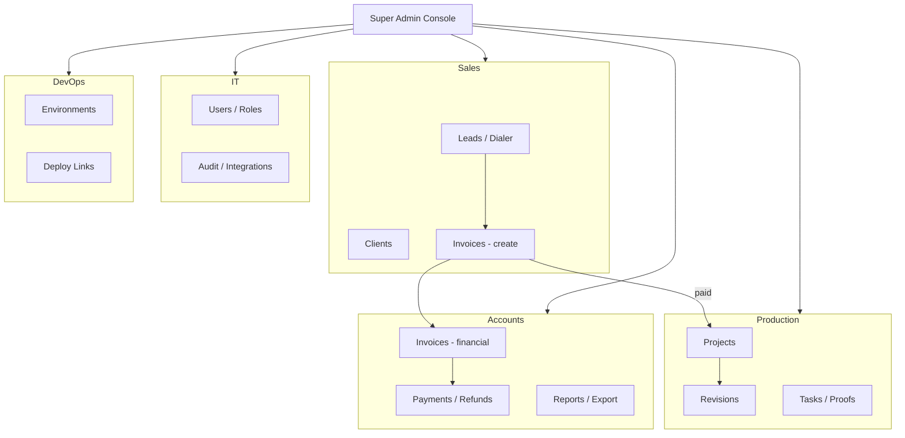

# Enterprise Operations Platform — Master Plan

**Product name (working):** Unified CRM & Operations Hub  
**Current state:** PHP 8.2 + MySQL CRM (Sales + Production slice implemented)  
**Target state:** Multi-department platform with granular RBAC, Super Admin, and room to scale  
**Recommended future stack:** Node.js API + React/Next.js UI + MySQL 8 (PostgreSQL optional later)

---

## 1. Executive summary

You are building more than a sales CRM. You need an **organization-wide system** where:

- **Sales** owns leads → close → invoice → client relationship  
- **Production** (Design + Development) owns delivery, revisions, proofs  
- **Accounts** owns money: invoices, payments, refunds, chargebacks, payroll-related exports  
- **IT** owns users, permissions, integrations, audit, system health  
- **DevOps** owns deployments, environments, incident flags, release notes (internal)  
- **Super Admin** sees and overrides **everything** across departments  

The existing PHP app is a **valid Phase 0 MVP** for Sales + Production. For the complexity you described, a **planned migration to Node.js** (API-first) is the right long-term choice—not because PHP fails, but because you will need:

- Hundreds of permission combinations (department × designation × action)  
- Real-time notifications, dashboards, and later mobile apps  
- Integrations (payment gateways, WhatsApp, telephony, Git, CI/CD webhooks)  
- Cleaner separation: frontend / API / workers / reporting  

**Decision:** Keep PHP running while building **v2 on Node** in parallel, then migrate department by department.

---

## 2. Department & role model

### 2.1 Departments (org units)

| Code | Department | Primary responsibility |
|------|------------|------------------------|
| `sales` | Sales | Leads, pipeline, closing, upsell, client comms |
| `production` | Production | Projects, assignments, revisions, delivery (design + dev teams live here) |
| `accounts` | Accounts | Invoicing, payments, reconciliation, refunds, financial reports |
| `it` | IT | Users, roles, security, integrations, support tickets (internal) |
| `devops` | DevOps | Environments, deploy logs, uptime, release pipeline metadata |
| `exec` | Executive (optional) | Read-only dashboards across all depts |

**Note:** Design and Development are **teams inside Production**, not top-level departments—unless you later split them.

### 2.2 Designation = Role template within a department

Each user has:

- `department_id` (primary)  
- `designation_id` → maps to a **role template** (permissions bundle)  
- `manager_id` (reporting line)  
- `extra_department_ids[]` (optional cross-dept access, e.g. Accounts lead also sees Sales invoices)

### 2.3 Super Admin

| Capability | Description |
|------------|-------------|
| Global visibility | All leads, projects, invoices, logs, users |
| Impersonation (audited) | View-as-user for support (optional Phase 3) |
| Permission override | Emergency freeze project, force refund status, reassign lead |
| Org settings | Branding, SMTP, tax, prefixes, feature flags |
| Department admin | Create/disable departments and designation templates |
| Audit | Full `audit_log` + `email_log` + security events |

Super Admin is **not** the same as “IT Admin”—IT manages day-to-day users; Super Admin is root governance.

---

## 3. Role matrix by department

### Sales

| Designation | Key permissions |
|-------------|-----------------|
| Lead Finder | Create/import leads, view own leads, metrics |
| Sales Rep / Closer | Assigned leads, dialer workspace, log calls, create invoices |
| Sales Team Lead | All team leads, reassign, approve discounts |
| Sales Manager | Department reports, round-robin config, targets |

### Production (Design + Development)

| Designation | Key permissions |
|-------------|-----------------|
| Junior Designer / Developer | My tasks, submit work, upload proofs |
| Senior | Same + review peers (optional) |
| Design Head / Dev Head | Dept queue, assign, approve before client handoff |
| Production Manager | All production projects, SLA reports, workload |

### Accounts

| Designation | Key permissions |
|-------------|-----------------|
| Accounts Executive | View invoices, record payments, send reminders |
| Accounts Manager | Approve refunds/chargebacks, lock periods, exports |
| Finance Controller | Full ledger view, tax reports, reconciliation |

### IT

| Designation | Key permissions |
|-------------|-----------------|
| IT Support | Reset passwords, view logs (no financial override) |
| IT Admin | User CRUD, role templates, integration keys |
| Security Officer | Audit export, session kill, IP allowlist (Phase 4) |

### DevOps

| Designation | Key permissions |
|-------------|-----------------|
| DevOps Engineer | Link projects to repos/staging URLs, deployment notes |
| DevOps Lead | Environment dashboard, incident banner on CRM (internal) |

### Super Admin

| Designation | Key permissions |
|-------------|-----------------|
| Super Admin | `*` on all modules + system config |

---

## 4. Permission system (technical design)

Replace hardcoded `RBAC_PAGES` with **attribute-based access**:

```
permission = department + resource + action
Examples:
  sales.leads.read
  sales.leads.assign
  sales.invoices.create
  production.projects.assign
  accounts.payments.record
  it.users.manage
  devops.deployments.read
  *.*.*  (super admin only)
```

**Tables (v2):**

- `departments`  
- `designations` (slug, department_id, level)  
- `permissions` (slug)  
- `designation_permissions` (many-to-many)  
- `users` (department_id, designation_id, manager_id)  
- `user_permission_overrides` (grant/deny per user, optional)

**UI:** IT Admin configures designation templates; Super Admin can override.

---

## 5. Module map (what each department sees)



### 5.1 Cross-cutting modules (all relevant depts)

| Module | Owner dept | Others |
|--------|------------|--------|
| Notifications | System | Read own |
| Global search | System | Scoped by permission |
| Activity timeline | System | Entity-level |
| Documents / files | System | Upload per project/lead |
| Reports | Per dept | Super Admin: all |

### 5.2 New modules not in PHP MVP

| Module | Department | Priority |
|--------|------------|----------|
| Payment recording | Accounts | Phase 2 |
| Chart of accounts / GL export | Accounts | Phase 3 |
| Discount approval workflow | Sales → Accounts | Phase 2 |
| Internal support tickets | IT | Phase 3 |
| Repo / staging / CI links | DevOps + Production | Phase 2 |
| Department KPI dashboards | Each + Super Admin | Phase 2 |
| WhatsApp / telephony log sync | Sales | Phase 3 |
| Payroll commission calc | Accounts + Sales | Phase 4 |

---

## 6. Recommended technology stack (v2)

### Why Node.js for v2

| Factor | PHP (current) | Node.js (v2) |
|--------|---------------|----------------|
| Complex RBAC | Becomes messy in single app | Middleware + policy layer scales |
| Real-time | Polling / HTMX | WebSockets (Socket.io) native |
| API for mobile | Build separately | Same REST/GraphQL API |
| Background jobs | Cron scripts | BullMQ / Redis queues |
| Team hiring | Common on cPanel | Standard for SaaS products |
| Type safety | Optional | TypeScript strongly recommended |

### Proposed stack

| Layer | Technology |
|-------|------------|
| API | **Node 20 LTS** + **Express** or **Fastify** |
| Language | **TypeScript** |
| ORM | **Prisma** or **Drizzle** (MySQL) |
| Auth | **JWT** (access + refresh) + httpOnly cookies for web |
| Validation | **Zod** |
| Frontend | **Next.js 14+** (App Router) + Tailwind + shadcn/ui |
| Cache / queues | **Redis** (sessions, jobs, rate limit) |
| Files | S3-compatible or local `uploads/` with signed URLs |
| Email | **Nodemailer** (same SMTP as today) |
| PDF | **Puppeteer** or **pdfkit** (replace FPDF) |
| Deploy | Docker on VPS **or** cPanel Node app **or** Railway/Render |

**Database:** Stay on **MySQL 8** initially—migrate schema with Prisma migrations; no forced Postgres move.

### Monorepo layout (suggested)

```
/ops-platform
  /apps
    /web          → Next.js frontend
    /api          → Node API
  /packages
    /shared-types → DTOs, enums
    /rbac         → permission checks
  /docker
  docker-compose.yml  → mysql, redis, api, web
```

---

## 7. Data model evolution

### 7.1 Keep from current CRM (migrate)

- leads, clients, conversations  
- invoices, invoice_items  
- projects, project_assignments, project_revisions, revision_files  
- project_budget_lines, notifications, audit_log, email_log  
- settings (key-value → `system_settings` table)

### 7.2 Add for enterprise

| Entity | Purpose |
|--------|---------|
| `departments` | sales, production, accounts, it, devops |
| `designations` | role templates per dept |
| `permissions` | granular slugs |
| `designation_permissions` | template grants |
| `payments` | accounts records against invoices |
| `approval_requests` | discount, refund, chargeback |
| `department_dashboard_config` | widgets per dept |
| `integration_credentials` | IT-managed encrypted secrets |
| `deployment_records` | devops ↔ project link |
| `sessions` / `refresh_tokens` | auth v2 |

### 7.3 Production sub-teams

```
production_department
  ├── team: design (head + juniors)
  └── team: development (head + juniors)
```

Implement as `production_teams` or `department_id` on users with slug `design` / `development` under production—matches your current schema spirit.

---

## 8. API & frontend principles

- **REST first** (`/api/v1/...`), OpenAPI spec generated  
- Every route: `authenticate` → `authorize(permission)` → handler  
- Department scope in queries: `WHERE department_id IN (:allowed)` unless Super Admin  
- Frontend: route groups `/sales/*`, `/production/*`, `/accounts/*`, `/admin/*`  
- Super Admin: `/super/*` with department switcher in header  

---

## 9. Security & compliance baseline

- Password hashing: bcrypt (same as now)  
- CSRF: not needed for pure JWT API; use SameSite cookies if cookie-based  
- Rate limiting on login and public endpoints  
- Audit every: login, permission change, financial status change, impersonation  
- File upload: MIME allowlist, virus scan hook (Phase 3), no execution in upload dir  
- Secrets: env vars + IT integration vault—not in `settings` plaintext for prod  

---

## 10. Deployment strategy

| Environment | Purpose |
|-------------|---------|
| Local | Docker Compose (MySQL + Redis + API + Web) |
| Staging | Mirror prod; DevOps dept tests releases |
| Production | VPS Docker or managed PaaS |

**cPanel path:** PHP app remains until v2 ready; Node can run as secondary app on subdomain `app.yourdomain.com`.

---

## 11. Implementation phases (roadmap)

### Phase 0 — Done (current)

PHP CRM: Sales pipeline, invoicing, production routing, revisions, PDF, SMTP, uploads.

**Action:** Finish local install + UAT on PHP; collect real workflow feedback.

### Phase 1 — Foundation (4–6 weeks)

**Goal:** Node monorepo skeleton + auth + RBAC + user/department CRUD

- [ ] Init monorepo (api + web + shared)  
- [ ] Prisma schema: departments, designations, permissions, users  
- [ ] Seed Super Admin + 5 departments + sample designations  
- [ ] JWT auth, login, refresh  
- [ ] Permission middleware  
- [ ] Super Admin UI: departments, designations, users  
- [ ] Migrate **read-only** import script from MySQL PHP DB  

**Deliverable:** Login as Super Admin; IT Admin can create users with designation; no business workflows yet.

### Phase 2 — Sales + Accounts core (6–8 weeks)

- [ ] Port leads, dialer API, conversations  
- [ ] Port invoices; Accounts dept: record payments, partial paid  
- [ ] Approval workflow: refund/chargeback (Accounts approves, Sales requests)  
- [ ] Branded PDF + email (Nodemailer)  
- [ ] Department dashboards (Sales manager, Accounts manager)  

**Deliverable:** Sales can run full cycle; Accounts reconciles money; PHP can be retired for Sales or run parallel.

### Phase 3 — Production + DevOps (6–8 weeks)

- [ ] Port projects, assignments, revision ledger, file uploads  
- [ ] Head approval gate, seller notify (WebSocket)  
- [ ] DevOps: link repo URL, staging URL, environment tags on project  
- [ ] Production manager workload view  

**Deliverable:** End-to-end lead → invoice → project → revision matches PHP feature parity+.

### Phase 4 — IT module + hardening (4 weeks)

- [ ] Audit log UI, email log, integration settings  
- [ ] Password policies, session management  
- [ ] Global search, export CSV  
- [ ] Automated tests (API integration + critical E2E)  

### Phase 5 — Advanced (ongoing)

- Payment gateway (Stripe/local)  
- Commission rules  
- Mobile-responsive PWA or React Native shell  
- BI / Metabase connection  
- Multi-tenant (if you sell CRM to others)—only if needed  

---

## 12. Migration from PHP to Node

1. **Freeze** PHP feature set; only bugfixes.  
2. **Export** MySQL data; Prisma seed/migration scripts map old `roles` → new `designations`.  
3. **Parallel run** 2–4 weeks: new writes on Node, PHP read-only—or cutover weekend.  
4. **DNS cutover** `app.domain.com` → Next.js; archive PHP folder.  

| Old role slug | New designation (example) |
|---------------|---------------------------|
| admin | Super Admin |
| lead_finer | Sales · Lead Finder |
| seller | Sales · Closer |
| design_head | Production · Design Head |
| designer | Production · Junior Designer |
| dev_head | Production · Development Head |
| developer | Production · Junior Developer |

---

## 13. What you should decide before Phase 1 code

| # | Question | Recommendation |
|---|----------|----------------|
| 1 | Design/Dev: separate departments or teams under Production? | Teams under **Production** |
| 2 | Can one user belong to two departments? | Yes, via `user_departments` junction (Phase 2) |
| 3 | Accounts creates invoice or only Sales? | Sales creates; Accounts confirms payment & refund |
| 4 | DevOps data linked to project or global only? | Per project + global environment registry |
| 5 | Hosting target for v2 | Docker VPS (simplest for Node + Redis) |
| 6 | Keep cPanel PHP long-term? | No—use PHP only until v2 cutover |

---

## 14. Immediate next steps (when you say "implement")

1. Confirm department list and designation names (customize matrix in §3).  
2. Approve Node + Next.js + MySQL + Redis stack (§6).  
3. Start **Phase 1** repo scaffold in `f:\CRM for sales\v2\` or new repo `ops-platform`.  
4. Keep PHP server for demos; v2 on `localhost:3000` + `localhost:4000`.  

---

## 15. Document index

| Doc | Contents |
|-----|----------|
| `docs/BLUEPRINT.md` | Original sales/production blueprint ↔ PHP map |
| `docs/ENTERPRISE_PLATFORM_PLAN.md` | This master plan |
| `README.md` | PHP deploy instructions (Phase 0) |

---

*Version 1.0 — Plan only. No v2 code until you approve Phase 1 start.*
